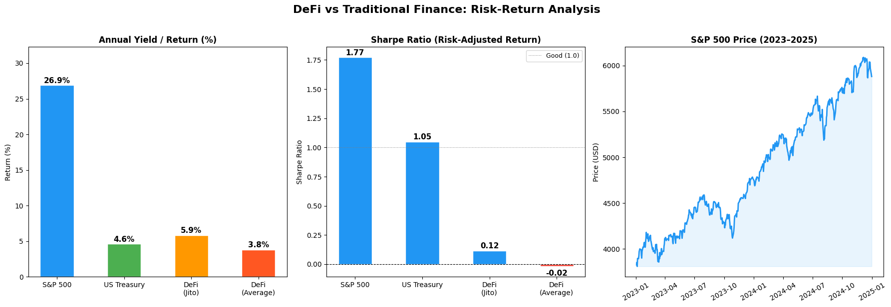

# DeFi vs Traditional Finance: A Risk-Return Analysis

A comparative study of risk-adjusted returns across three asset classes — U.S. equities (S&P 500), U.S. sovereign debt (10-Year Treasury), and decentralized finance (DeFi) lending and staking protocols — over the 2023–2024 period.



## Research Question

DeFi protocols frequently advertise double-digit yields that appear to dominate traditional fixed-income instruments. When these yields are adjusted for realized volatility and compared to equities, does the advantage hold? This project computes a like-for-like risk-return comparison using live market data and the Sharpe ratio as the primary risk-adjusted performance measure.

## Data Sources

| Asset class | Source | Series | Frequency |
|---|---|---|---|
| S&P 500 | Yahoo Finance (`yfinance`) | `^GSPC` close prices | Daily, 2023-01-01 to 2025-01-01 |
| U.S. 10Y Treasury | FRED (`pandas_datareader`) | `GS10` yield | Monthly |
| DeFi protocols | DeFiLlama public API (`yields.llama.fi/pools`) | APY and TVL snapshot | Live query at notebook run time |

The DeFi universe was filtered to protocols with TVL above $500M and APY between 0% and 100% to exclude unaudited or thinly-capitalized pools and to eliminate obvious outliers. The top 15 protocols by APY were retained.

## Methodology

1. **Return measurement.** For the S&P 500, annualized return is computed from the two-year cumulative price change divided by two. For Treasuries, the most recent monthly yield is used. For DeFi, the reported APY at query time is used as the expected annual return.
2. **Volatility measurement.** S&P 500 annualized volatility is computed as the standard deviation of daily log-like returns scaled by √252. DeFi volatility is set to a conservative 15% estimate; no public daily mark-to-market series is available for most DeFi yield tokens, which is called out as a limitation below.
3. **Risk-free rate.** The mean of the 10Y Treasury yield over the sample window (≈ 4.10%) serves as the risk-free benchmark.
4. **Sharpe ratio.** Computed as `(Return − Risk-free rate) / Volatility` for each asset class.

## Key Findings

| Asset | Yield / Return | Volatility | Sharpe |
|---|---:|---:|---:|
| S&P 500 | 26.90% | 12.87% | 1.77 |
| U.S. 10Y Treasury | 4.63% | — | 1.05 |
| DeFi — Jito (top yield) | 5.86% | ~15% (est.) | 0.12 |
| DeFi — Top 15 average | 3.82% | ~15% (est.) | −0.02 |

Three results stand out:

- Over the 2023–2024 window, the S&P 500 produced the highest risk-adjusted return by a wide margin, driven by the post-2022 equity recovery and relatively contained volatility.
- After filtering for established, well-capitalized protocols, DeFi APYs cluster at 3–6% — below, not above, the U.S. 10Y Treasury yield. The narrative of DeFi as a high-yield alternative is driven largely by smaller, higher-risk pools excluded here.
- Under the volatility assumption used, the average top-15 DeFi protocol delivered a negative Sharpe ratio, meaning an investor would have been compensated less than the risk-free rate for bearing smart-contract, custody, and liquidity risk.

## Limitations

This analysis is intended as a directional comparison, not an investment recommendation. Several caveats are material:

- **DeFi volatility is assumed, not measured.** Most DeFi yield tokens lack a clean daily USD price series. The 15% figure is a rough prior; realized volatility during market stress events has been substantially higher for several protocols in the sample.
- **Yield is a point-in-time snapshot.** DeFi APYs are computed by each protocol and can change materially day-to-day as TVL and borrow demand shift. The S&P 500 and Treasury numbers reflect realized history; the DeFi numbers are forward-looking.
- **Risks are not fully priced.** Smart-contract failure, oracle manipulation, stablecoin depeg, and validator slashing are tail risks not captured by a Sharpe ratio.
- **Time horizons differ.** The S&P 500 return reflects a full two-year window; DeFi APYs reflect current rates only.
- **Return calculation is approximate.** Dividing cumulative return by two is a simplification of true annualization.

A more rigorous version of this study would estimate DeFi volatility from the daily price series of the underlying yield tokens and use rolling-window Sharpe ratios to compare regime-dependent performance.

## Repository Contents

| File | Description |
|---|---|
| `DeFi_vs_Traditional_Finance.ipynb` | Main analysis notebook with all data collection, computation, and plotting code |
| `comparison_summary.csv` | Tabular summary of yield and return figures across asset classes |
| `defi_vs_traditional.png` | Three-panel risk-return visualization |
| `README.md` | This file |

## Reproducing the Analysis

The notebook was developed in Google Colab. To run locally:

```bash
pip install yfinance pandas-datareader pandas numpy matplotlib requests
jupyter notebook DeFi_vs_Traditional_Finance.ipynb
```

Re-running the notebook will produce updated numbers, since the DeFi API returns live data and `yfinance` pulls the most recent S&P 500 close prices available.

## License

Released under the MIT License.
